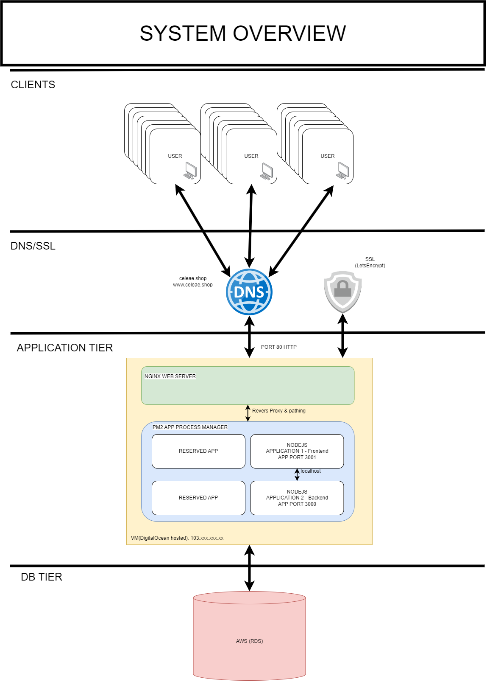
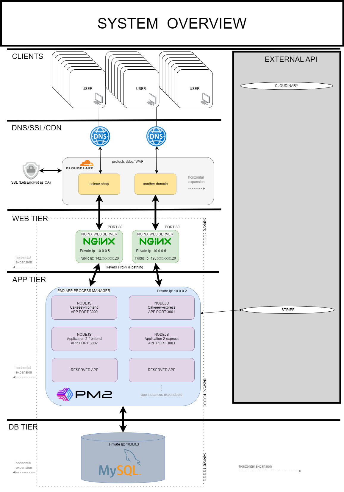
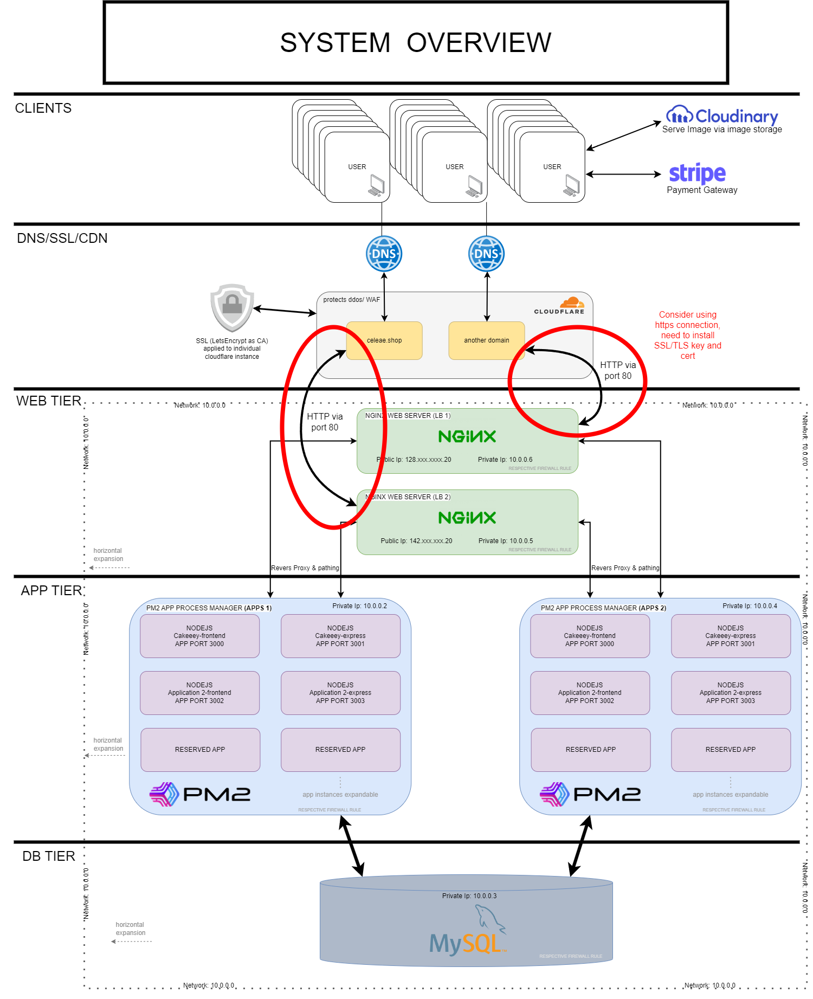
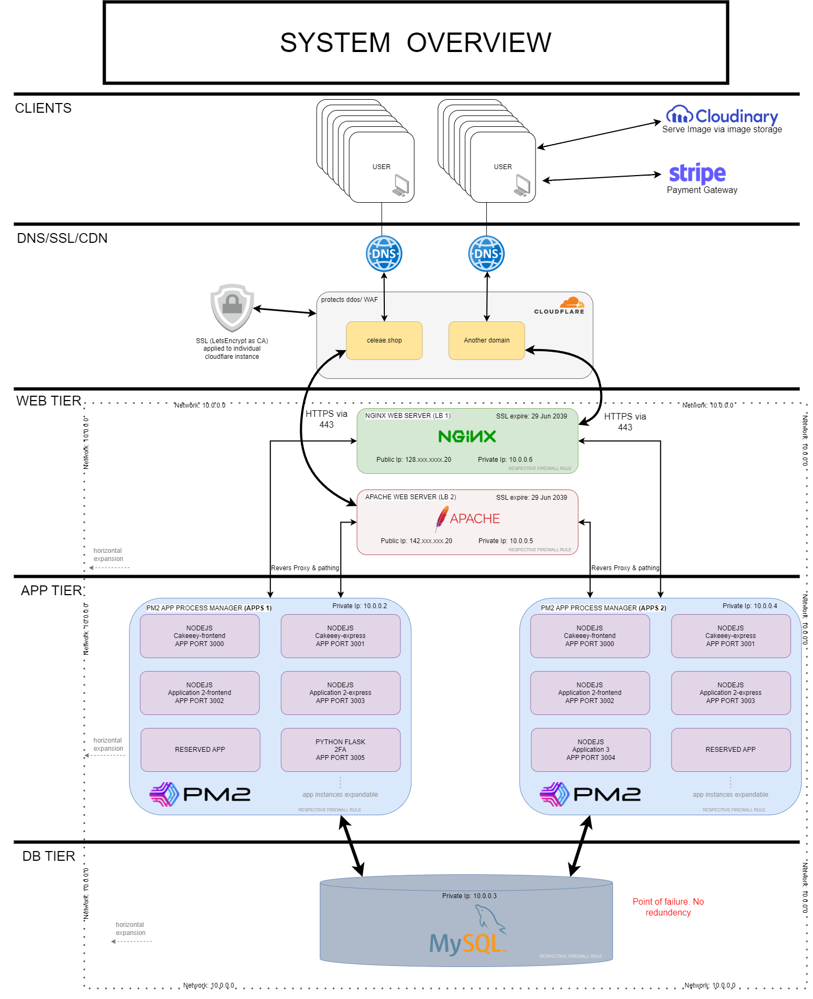
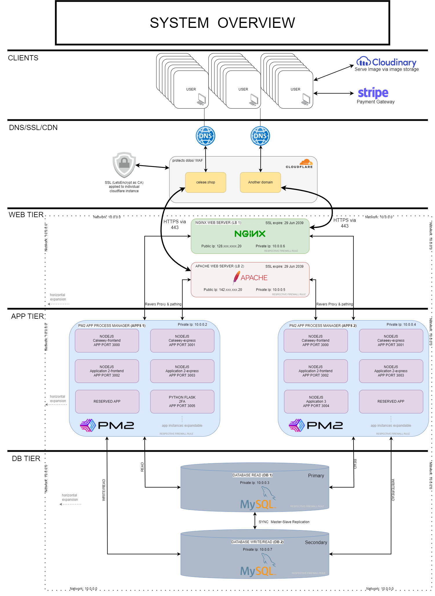

# Cloud Infrastructure/ Architecture

## Project Summary

**Project Context**
This repository is to have an open ideation on the cloud infrastructure and architecture. It aims to be progressive and discuss about the pros/cons about certain way of system architecture.

**Ideation & Thought Promotion**
There will be a list of implementation after this section. They are mainly based on my personal learning of system architecture. Most of the architecture has been implemented and tested. Please refer to the list of technology used at the bottom of the page.

### **2-Tier**
 

### **3-Tier**
 

### **Cloudflare**
 

### **Application Tier Scaling & Reliability**
 

### **SSL & Secured Connections**
 

### **DB replication: Master & Slave**
 

### **Regional replication & TCP/UDP Load Balancing**
 
